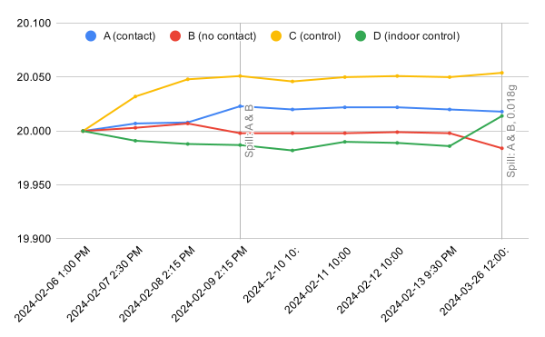

# Experiment: Powder Weight &  Humidity

Four equal samples of Varget were stored in different environments and weighed over time.
The environmental conditions (temperature, relative humidity, dew point) were also tracked hourly in these environments using Kestrel Drops.

Each sample started as 20.000 grams of Varget (from the same 1 lb jug).

### Samples
- **A:** Stored in direct contact with a 50% humidity pack, sealed in an airtight container.
- **B:** Stored in the same airtight container as Sample A, but not in direct contact with the humidity pack.
- **C:** Stored in an MTM container with (but not in) the airtight container as Sample A & B. These three samples were stored in my garage.
- **D:** Stored indoors in a closed cabinet.

### Kestrel Drops
- **Blue:** Stored with Sample A & B.
- **Orange:** Stored with Sample C.
- **Green:** Stored with Sample D.

## Powder Weight Chart

## Environment Chart

